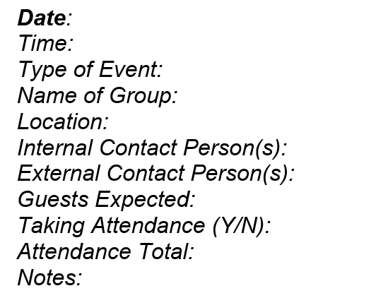

## The Block Museum Calendar Project

This is the repository for "block_converter.exe", an application used at the Block Museum at Northwestern University to format Outlook calendar events into a custom weekly calendar archive format used by the museum.

### The Problem

Staff maintain weekly calendar archives as a record of past events and attendance. Before this application was created, producing these archives required several time-intensive, manual steps: exporting the Outlook calendar to PDF, manually transferring and formatting event information into the museum's template, and correcting data-entry mistakes.

Much of this process could be automated. The `block_converter.py` script, compiled into `block_converter.exe` for everyday use, automates the conversion and formatting process.

### The `block_converter.py` Script

The script takes a CSV export of an Outlook calendar as its input and produces a formatted Microsoft Word (`.docx`) document as its output. The script performs the following steps:

1. Prompts the user to select a CSV file

When `block_converter.exe` is opened, a file-selection window asks the user to select a CSV file of the current week's calendar events. 

2. Reads and prepares calendar data
The script keeps the following fields from Outlook: `['Subject', 'Start Date', 'Start Time', 'End Time', 'Description', 'Location']`. `Description`
is the column which contains the Required Fields Template, which all events must follow:

`Description` already includes date, time, subject, and location information. However, the other columns are exported directly from Outlook instead to doubly ensure correct information in the final Word document.

3. Cleans and filters calendar events

Before creating the Word document, the script removes or modified information that should not appear in the weekly archive.

- Date and time fields are combined into usable datetime objects
- Subjects with the following names are excluded: `['CANCELED', 'AUTOMATED', 'OOO', 'Required Fields Template']`
- Event descriptions remove unnecessary line breaks and Zoom meeting information

4. Formats the Word document

The script uses `python-docx` to generate a new Word document, and made to fit the custom template:
- A centered document title: **Weekly Events Attendance Totals**
- Events grouped by date sequentially
- A bold date heading for each day, with a horizontal line underneath
- The Required Fields Template underneath each event line
- Specific fonts, font sizes, margins, spacing, indentation, and other formatting required by the museum's template

The script generates the document programmatically rather than modifying an existing Word template.

5. Saves the finished document

After processing all events in the CSV file, the program opens a save dialog and asks the user where to save the completed `.docx` file. 

### Power Automate Implementation

In the New Outlook, the feature to export the Outlook calendar directly to CSV was removed, so a workaround using Power Automate was produced to generate weekly CSV files. The flows are only available when logged in to the Visitor Services account on Power Automate: [automatic method](https://make.powerautomate.com/environments/Default-7d76d361-8277-4708-a477-64e8366cd1bc/flows/e9645e33-5fd3-4100-91a6-476698295b98/details) and [manual method](https://make.powerautomate.com/environments/Default-7d76d361-8277-4708-a477-64e8366cd1bc/flows/579ecf57-d986-49c0-8282-512f33db35fb/details). 

First is an automatic flow, which exports Outlook calendar events to CSV. The flow includes the following actions:
1. `Recurrence` trigger: occurs every Sunday 10:00 AM at UTC-6
2. `Get calendar view of events (V3)`: selects the start and end times for the events to be included in the CSV file. Selection is from Sunday at 12:00 AM of the current week, to Saturday at 11:59:59 PM of the current week. 
3. `Initialize variable`: creates an array for the events
4. `For each` loop, applies to each event in the array
	a. `Html to text`: converts `Body` (all Outlook calendar event information) into text
	b. `Compose`: selects relevant information from `Body` and places all required columns for the `block_converter` into a dictionary: `['Subject', 'Start Date', 'Start Time', 'End Time', 'Description', 'Location']` 
	c. `Append to array variable`: add to array
5. `Create CSV table`: convert array to CSV table
6. `Create file`: converts CSV table to CSV file and saves to the Block Museum SharePoint, under the folder `Unprocessed Weekly Calendar Files`. `File Name` is automatically formatted using an expression that finds the current week's dates.
7. `Send an email (V2)`: a backup CSV file is sent to the Visitor Services email.

Second is a manual flow, which does the same as the automatic flow but uses a Google form instead of a `Recurrence` trigger for manual date selection. The only differences are in the first two actions:
1. `When a new response is submitted` trigger: collects information from the Google form that was submitted. In this form, users can manually select the Start and End dates to be included in the CSV file, rather than be limited to the current week.
2. `Get response details`: compiles this information
All other actions are the same except with slight changes to expressions to account for the Google form data.

 

### Important Maintenance Information

To download dependencies for the `block_converter.py` script, install the listed import modules in the script. Then use py-installer to compile a modified script to exe.

The `block_converter.exe` is designed to be as future proof as possible. As such, troubleshooting future problems may include:
- New CSV files no longer being exported to `Unprocessed Weekly Calendar Files`
	- This is a Power Automate problem. In this case, it is necessary to check the run history of both flows to see which flows have failed. It may be that Outlook has updated the way they provide event information in `Get Calendar View of Events (V3)`. Otherwise, it may be easier to check if the New Outlook has released a feature yet that allows for the direct export of CSV files.
- The `.docx` file is not being generated, or is being generated incorrectly
	- This is a problem with the `block_converter.exe` applcation. In this case, it will be necessary to troubleshoot the `block_converter.py` script and re-compile the application when modifications have been made. Make a copy of this repository as needed.
- Events in the CSV files are not correctly aligning with dates, or some dates/times are missing
	- This is likely a Power Automate timezone problem. Check the `Recurrence` trigger or any other actions that include `utcNow` to ensure the timezone logic matches Central Standard Time.
- A new type of event should be excluded
	- This will require adding masks to the `block_converter.py` script and re-compiling the `.exe` file. 

For any other problems, ask a programmer for assistance, and reference this README.

### Instructions for Use

The pipeline functions as such:
Power Automate automatic/manual CSV export into `Unprocessed Weekly Calendar Files` on SharePoint -> open the CSV file in the `block_converter` file dialog and save `.docx` elsewhere -> final modifications to the `.docx`.

Detailed instructions are located under the Visitor Services SharePoint.